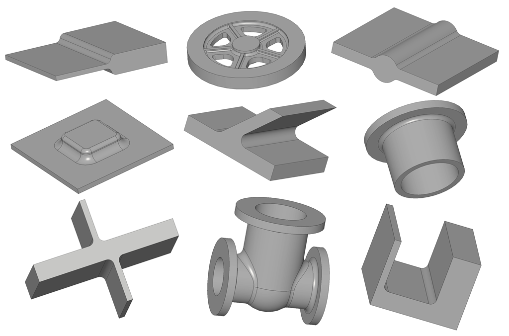
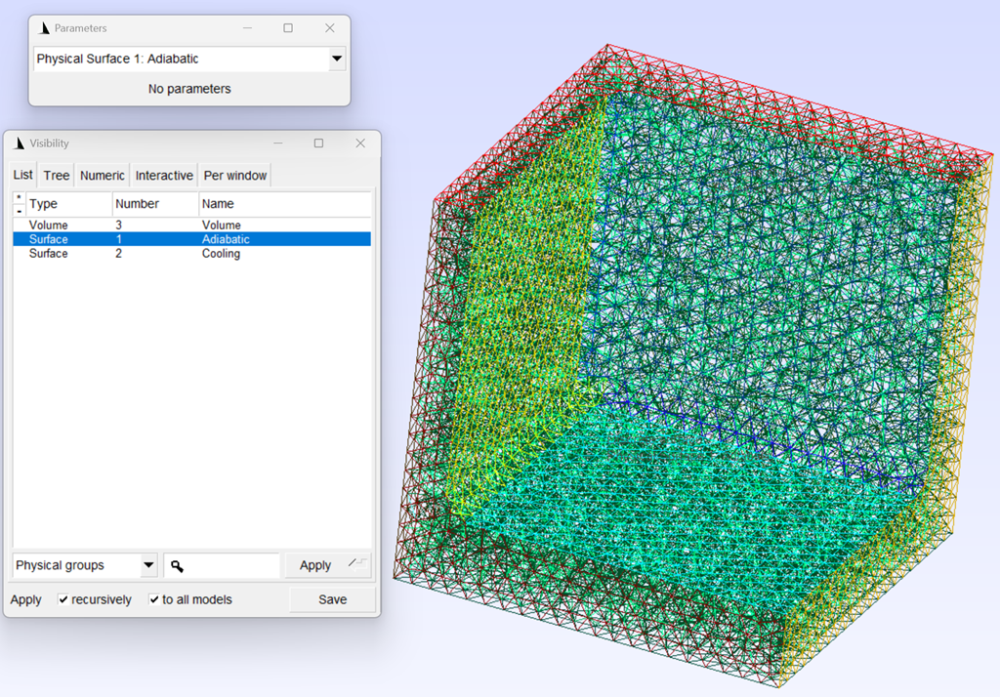

# casting-gnn-solidification — GNN surrogate for casting solidification on tetra meshes

> **Project status:** **WIP / in active development.**  
> The end-to-end pipeline works, but interfaces, configs, and training/visualization behavior are still evolving.  
> Expect breaking changes; please pin commits if you depend on this code.

A research/engineering repository for learning thermal diffusion / cooling dynamics during metal solidification on tetrahedral meshes using Graph Neural Networks (PyTorch Geometric).

The core idea is to convert each casting mesh into a graph and train a MeshGraphNet-style model to predict temperature evolution (delta-learning), enabling fast inference and hotspot analysis.

---

## Project Structure
```
casting-gnn-solidification/
├── data/                   # Raw .msh and .npz files (9,710 pairs)
├── step/                   # Procedural CAD generation
├── data_pyg/               # Processed .pt binary files for PyG
├── weights/                # Saved model checkpoints
├── src/                    # Core logic
│   ├── model.py            # MeshGraphNet architecture
│   ├── dataset.py          # CastingDataset with SDF calculation
│   └── train.py            # Delta-learning training loop
├── 3dgen.py                # Script for generating L, X, T, U-shapes, etc.
├── meshgen.py              # Gmsh-based tetrahedral mesh generator
├── convert_to_pyg.py       # Data integration script
├── main.py                 # Training entry point
├── visualize.py            # PyVista-based interactive visualizer
├── environment.yml         # Conda environment configuration
└── README.md
```

## End-to-end pipeline

1. CAD generation (STEP) -> step/ or exported STEP folder
2. Tetra meshing (Gmsh: MSH) -> data/.msh
3. Thermal simulation (ground truth)-> data/.npz
4. Convert to graph dataset (PyG) -> data_pyg/.pt (+ stats/manifests if enabled)
5. Train ΔT model (autoregressive) -> weights/.pt (checkpoints)
6. Inference + visualization -> PyVista viewer / screenshots

### What files must match
The pipeline assumes **paired files with identical stems**, e.g.
- `data/WH_19_45.msh`
- `data/WH_19_45.npz`

---

## Data format (raw)

### Mesh (`.msh`)
- Tetrahedral volume mesh (Gmsh)
- Boundary/physical tags are strongly recommended (for boundary condition encoding)

### Simulation snapshots (`.npz`)
Expected contents depend on your generator, but typically include:
- `times`: shape `(T,)`
- temperature snapshots either on **nodes** and/or **cells**, e.g.:
  - `snapshots_nodal`: shape `(T, N_nodes)`
  - `snapshots_cell`:  shape `(T, N_cells)`

> If your `.npz` keys differ, adjust the mapping in `convert_to_pyg.py` and/or `src/dataset.py`.

---

## Model & training concept

### Delta-learning (ΔT)
Instead of predicting absolute temperature directly, the model predicts the increment:

$T_{t+1} = T_t + \Delta T_{\text{pred}}$

This usually stabilizes training and improves rollout behavior.

### MeshGraphNet-style message passing
- Node features: coordinates, temperature state, optional SDF, boundary markers, etc.
- Edge features: relative vectors/distances, adjacency info
- Processor: multiple MP blocks with residual connections

### Autoregressive rollout
At inference time, the model can roll forward for many steps:
- either with teacher forcing (during training)
- or purely autoregressive (during evaluation)

---

## Installation

### 1) Create environment
```bash
conda env create -f environment.yml
conda activate cast_gnn
```

### 2) Quick sanity check

```
python -c "import torch; print('torch:', torch.__version__, 'cuda:', torch.cuda.is_available())"
python -c "import torch_geometric; print('pyg ok')"
```
## Quickstart (recommended)

> The commands below show the intended flow.  
> **Important:** key generation/meshing settings are defined **at the top of the scripts**:
> - `3dgen.py`: main parameters for **3D model generation** (geometry variants, sizes/ranges, counts, seeds, etc.)
> - `meshgen.py`: selection of **adiabatic surfaces** (by labels/rules) and the **number of CPU cores** used for meshing

### A) If you already have raw data (`data/*.msh` + `data/*.npz`)

1) Convert raw pairs into PyG graphs:

    python convert_to_pyg.py --help
    python convert_to_pyg.py \
      --data_dir data \
      --out_dir data_pyg

2) Train:

    python main.py --help
    python main.py \
      --data_dir data_pyg \
      --out_dir weights \
      --device cuda

3) Visualize a sample prediction:

    python visualize.py --help
    python visualize.py \
      --pt data_pyg/<sample>.pt \
      --ckpt weights/<checkpoint>.pt \
      --device cuda

### B) Full generation (CAD → mesh → simulate → train)

#### 1) Generate CAD (procedural 3D forms)

**Main generation settings are defined at the top of `3dgen.py`.**  
Below is a visual overview of the primary procedural forms:



Run:

    python 3dgen.py --help
    python 3dgen.py --out_dir step/generated --n 50 --seed 42

#### 2) Generate tetra meshes (Gmsh) + adiabatic markers

**Adiabatic surface selection rules and CPU core count are defined at the top of `meshgen.py`.**  
Example of highlighted adiabatic surfaces:



Run:

    python meshgen.py --help
    python meshgen.py --in_dir step/generated --out_dir data --mesh_size 6.0

#### 3) Produce `.npz` via your thermal solver (external or integrated in your workflow)

- Place results into `data/` using the same stem as the mesh.

#### 4) Continue with conversion + training as in (A)

---

## Script reference (I/O contract)

| Script | Purpose | Typical input | Typical output |
|---|---|---|---|
| `3dgen.py` | procedural geometry | params/seed | STEP files / geometry assets |
| `meshgen.py` | tetra meshing + markers | STEP | `.msh` in `data/` |
| *(solver)* | thermal ground truth | `.msh` | `.npz` in `data/` |
| `convert_to_pyg.py` | raw → PyG | `.msh` + `.npz` | `.pt` in `data_pyg/` |
| `main.py` | training entry point | `data_pyg/*.pt` | checkpoints in `weights/` |
| `visualize.py` | inspect mesh / rollout | `.pt` + checkpoint | interactive view / screenshots |

---

## Practical notes (GPU / performance)

- Autoregressive rollout can be numerically sensitive; start with:
  - shorter horizons,
  - teacher forcing during training,
  - stable normalization (ΔT stats).
- Conversion can be heavy for large meshes; consider batching and caching in `data_pyg/`.
- If you see “blobby spheres / artifacts” in visualization, check:
  - cell vs nodal field mapping,
  - unit/scale consistency (coords normalization),
  - correct association of temperature snapshots to mesh entities.

---

## Troubleshooting

- **No matching pairs found**  
  Ensure `data/*.msh` and `data/*.npz` share the same filename stem.

- **PyG / CUDA issues**  
  Your `torch` / `torch-geometric` wheels must match CUDA version. Rebuild the conda env if needed.

- **Visualizer shows weird inclusions or discontinuities**  
  Validate:
  1) `snapshots_nodal` length equals number of mesh nodes (if nodal),
  2) indexing order in `.msh` vs the array order in `.npz`,
  3) whether you visualize cell-scalars as point-scalars or vice versa.

---

## Roadmap (near-term)

- [ ] Single unified CLI (one entrypoint for generate → mesh → convert → train → viz)
- [ ] Formal dataset manifest + train/val/test splits
- [ ] Better boundary encoding (multi-class physical groups)
- [ ] Robust normalization for long rollouts (ΔT stats, optional log scaling)
- [ ] Quantitative metrics: rollout error vs horizon, hotspot localization score

## Hardware Requirements

To achieve efficient training and real-time visualization of the deep MeshGraphNet architecture, the following hardware specifications are recommended:

* **Graphics Processing Unit (GPU):** A dedicated NVIDIA GPU with CUDA support is mandatory for deep message passing and gradient calculations.
* **Video RAM (VRAM):** At least 8GB to 12GB of VRAM (e.g., NVIDIA RTX 3060 12GB) is required to handle the memory overhead of 12-15 processor layers when operating on complex tetrahedral meshes.
* **System Memory (RAM):** A minimum of 16GB-32GB of RAM is recommended to ensure smooth data conversion and mesh processing via `Meshio` and `CadQuery`.
* **Storage Capacity:** Approximately 150GB-200GB of free disk space is required to store the 9,710 raw simulation pairs (`.msh` and `.npz`) along with the processed PyTorch Geometric datasets.

> **Note:** While the model can run on a CPU for inference (prediction), training is not feasible on a CPU due to the iterative nature of the Delta-Prediction logic and the depth of the graph processor.